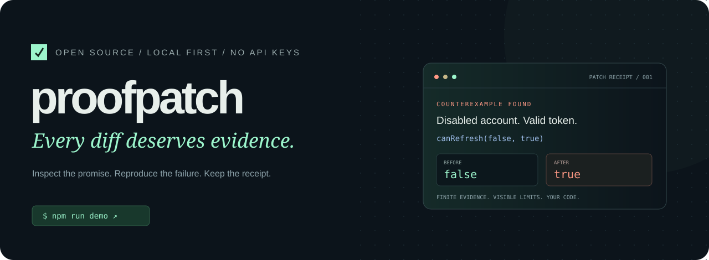
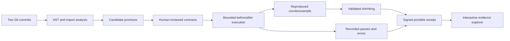

<p align="center"></p>

<p align="center">
  <a href="https://github.com/arnjos096-cmyk/proofpatch/actions/workflows/ci.yml"></a>
  
  <a href="LICENSE"></a>
  
</p>

<p align="center"><b>A code review you can interrogate.</b><br>Compare two Git snapshots. Challenge their behavior. Take the evidence with you.</p>

<p align="center"><a href="https://arnjos096-cmyk.github.io/proofpatch/">Explore the interactive demo</a> · <a href="#run-it-in-one-minute">Run locally</a> · <a href="#choose-your-path">Choose your path</a> · <a href="docs/architecture.md">Under the hood</a></p>

---

A patch says it “optimizes token refresh.” An ordinary test still passes. But a disabled account can now authenticate.

ProofPatch compares real **before and after executions**, finds a reproducing input, attempts to shrink it, and packages the result into a portable HTML + JSON receipt. The same workflow works for patches written by people or coding agents.

**The first release is a working, bounded TypeScript/JavaScript function verifier.** It combines AST analysis, reviewed behavioral contracts, differential execution, counterexample shrinking, and an offline evidence explorer. No account, API key, model download, or hosted backend is required.

## Run it in one minute

Requirements: **Node.js 22+ and Git**.

```bash
git clone https://github.com/arnjos096-cmyk/proofpatch.git
cd proofpatch
npm ci
npm run demo
```

Open **http://127.0.0.1:4317**. The command creates two temporary Git commits, analyzes them, executes the included contracts, and opens a local report server. The three failing demo contracts are intentional. Stop the server with Ctrl+C.

<details>
<summary><b>Prefer Docker? Expand for the two-command route</b></summary>

After cloning the repository:

```bash
cd proofpatch
docker compose up --build
```

Open http://127.0.0.1:4317. This runs the bundled demo in the application container. Testing arbitrary target modules in a separate hardened container uses `inspect --execute docker` from the host and requires Docker Engine plus the runner's Node image. Pull it once with `docker pull node:22-alpine`; the runner never pulls an image implicitly.

</details>

## Try to break the patch

Read this changed function before opening the answer:

```diff
 export function canRefresh(active: boolean, tokenValid: boolean) {
-  if (!active) return false;
-  return tokenValid;
+  if (tokenValid) return true;
+  return active && tokenValid;
 }
```

<details>
<summary><b>Reveal the counterexample</b> — which two inputs violate the promise?</summary>

```text
Contract   Disabled accounts cannot refresh a session
Arguments  [false, true]
Before     false
After      true
Verdict    FAILED
```

The fast path bypasses the account-status check. The demo also finds a removed lower bound in retry delays, while confirming that a reordered authorization expression preserves behavior on its declared input domain.

In the [interactive explorer](https://arnjos096-cmyk.github.io/proofpatch/), open a failed contract, inspect the before/after values, follow the impact graph, and jump to the changed source. Download the receipt and verify its hash locally.

</details>

## Choose your path

<details open>
<summary><b>01 / I want to inspect my own repository</b></summary>

Build the CLI once, then point it at a Git repository with two commits:

```bash
npm run build
node dist/cli.js inspect HEAD~1..HEAD --repo /path/to/your/repo --serve
```

This reads **committed snapshots**, not unsaved or uncommitted edits. It builds a relative-import impact graph, highlights changed exports and selected syntactic risks, and mines candidate promises from types, assertions, and test descriptions. Static mode does not execute target code.

Outputs: `.proofpatch/index.html`, `.proofpatch/receipt.json`, and `.proofpatch/summary.md`.

</details>

<details>
<summary><b>02 / I want executable evidence</b></summary>

First generate a draft for changed exported functions:

```bash
node dist/cli.js mine HEAD~1..HEAD \
  --repo /path/to/your/repo \
  --out proofpatch.contracts.draft.json
```

Review the input domains and oracles. The default `preserve` oracle asks whether both versions behave the same; preserving an existing bug is not correctness. Use an explicit expected value when you know the requirement.

```json
{
  "version": 1,
  "contracts": [{
    "id": "disabled-session",
    "title": "Disabled accounts cannot refresh a session",
    "file": "src/auth.ts",
    "export": "canRefresh",
    "arguments": [[false], [false, true]],
    "oracle": { "kind": "equals", "value": false }
  }]
}
```

Each inner `arguments` array is the allowed domain for **one parameter**. The engine explores combinations up to the case budget. For this example, the two cases are `[false, false]` and `[false, true]`.

Run only code you trust in local mode:

```bash
node dist/cli.js inspect HEAD~1..HEAD \
  --repo /path/to/your/repo \
  --contracts proofpatch.contracts.draft.json \
  --execute local --seed 42 --max-cases 64 --serve
```

Supported oracles:

| Oracle | Question answered |
|:--|:--|
| `preserve` | Do both versions return the same JSON value or throw the same error? |
| `equals` | Does the new version return the declared JSON value? |
| `type` | Does the new version return the declared JSON type? |
| `does-not-throw` | Does the new version return a supported JSON value without throwing? |

Missing imports, timeouts, invalid serialization, and runner failures are reported as incomplete/error evidence. They do not count as passes. Side effects are outside the oracle.

</details>

<details>
<summary><b>03 / I want a receipt that can be independently checked</b></summary>

Every receipt carries a SHA-256 digest of its canonical payload. The browser checks it when Web Crypto is available; the CLI works offline:

```bash
node dist/cli.js verify .proofpatch/receipt.json
```

For signatures, create keys outside your repository:

```bash
node dist/cli.js keygen --out ../proofpatch-keys
node dist/cli.js inspect HEAD~1..HEAD \
  --repo /path/to/your/repo \
  --sign ../proofpatch-keys/private.pem
node dist/cli.js verify .proofpatch/receipt.json \
  --public-key ../proofpatch-keys/public.pem
```

A matching digest checks internal integrity. A valid signature against a **separately trusted** public key authenticates that key's holder. Neither establishes that a patch is safe or that a claimed execution was honest. Keep private keys private.

</details>

<details>
<summary><b>04 / I want this in GitHub Actions</b></summary>

Add this to your repository. `fetch-depth: 0` makes the compared commits available. Pin third-party actions to reviewed commit SHAs in production.

```yaml
name: Patch evidence
on: [pull_request]
permissions:
  contents: read
jobs:
  inspect:
    runs-on: ubuntu-latest
    steps:
      - uses: actions/checkout@v4
        with:
          fetch-depth: 0
      - uses: arnjos096-cmyk/proofpatch@main
        with:
          base: ${{ github.event.pull_request.base.sha }}
          head: ${{ github.event.pull_request.head.sha }}
```

This produces a workflow summary and downloadable HTML/JSON artifact. It defaults to static mode. Only add `contracts` and `execute: local` when the code and workflow environment are trusted. Do not execute untrusted pull-request code in a privileged `pull_request_target` job.

Exit codes: `0` = completed without detected regression, `1` = failed contract, `2` = error/incomplete execution. Static “review” returns `0` unless you use `--fail-on-review`; exit `0` alone is not a correctness certificate.

</details>

## The evidence pipeline



| Component | What is implemented |
|:--|:--|
| Semantic inspection | TypeScript ASTs, named exports, signatures, body hashes, representative input domains |
| Change impact | Relative-import graph across both commits, transitive callers, potentially affected tests |
| Contract mining | Type, assertion, documentation and test-description candidates; reviewed JSON execution contracts |
| Behavioral checks | Four oracles, seeded bounded cases, async functions, before/after observations |
| Counterexamples | Reproducing inputs and bounded shrinking with rerun validation |
| Isolation options | Fresh bounded local processes; optional resource-limited, network-disabled Docker runner |
| Evidence explorer | Contract filtering, input/output drill-down, diff/source views, graph focus, candidate search, replay, JSON import/export |
| Portable verification | Single-file offline HTML, canonical SHA-256, Ed25519 signing and trusted-key verification |

## Scope, without guesswork

This release works best with **self-contained named exported functions and JSON values**. It supports tracked relative module imports. It does not install a target's npm dependencies; modules that cannot be bundled become explicit errors. Type inference and import analysis are bounded and heuristic, not a full TypeScript compiler project or whole-program analysis. The report records analysis limits.

Existing tests help locate promises and impacted modules; the runner does **not** run Jest/Vitest/Playwright suites. It does not prove filesystem, database, network, timing, or UI behavior. Nondeterministic functions require careful contracts. Passing a finite domain does not prove all possible inputs.

Local execution is not a security sandbox. See [the execution and trust model](SECURITY.md). The project uses no LLM in its current execution path; model-assisted candidate proposals, OpenAPI adapters, mutation testing, and signed CI provenance are future extensions.

## Build, test, contribute

```bash
npm ci
npm run check
npm run demo:generate
node dist/cli.js verify .proofpatch/receipt.json
```

Tests cover real temporary Git histories, behavioral regressions, runner limits, receipt tampering, signatures, export escaping, and the demo flow. See [CONTRIBUTING.md](CONTRIBUTING.md) for ownership boundaries and extension points.

<details>
<summary><b>Roadmap: useful next experiments</b></summary>

- [ ] OpenAPI request/response contracts and schema-aware generators.
- [ ] Mutation testing to measure which candidate promises actually catch changes.
- [ ] Explicit approval workflow for optional local-model proposals.
- [ ] Adapters for existing test runners and richer execution traces.
- [ ] Determinism checks across repeated executions.
- [ ] GitHub artifact attestations for published receipt provenance.

</details>

Built by [Arnav Joshi](https://github.com/arnjos096-cmyk). [MIT licensed](LICENSE). Clone it, challenge it, and contribute a counterexample.
